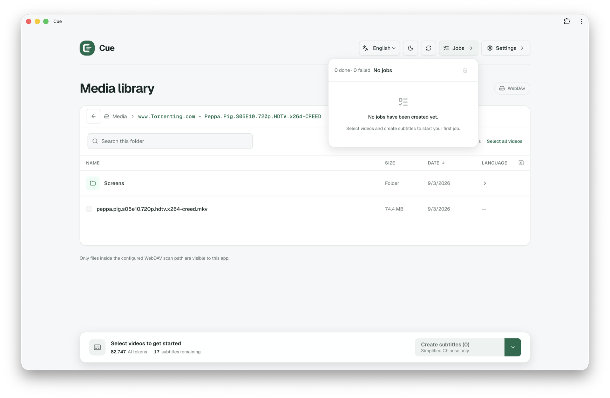

# Cue

**Find, sync, and translate subtitles for your video library.**

Cue is a local web app for videos on WebDAV or your own filesystem. Choose a language, select your videos, and let Cue handle the subtitles.

- **Find subtitles** from existing sidecar files or OpenSubtitles.
- **Sync locally** using a five-minute audio sample.
- **Translate English** through a configurable Chat Completions endpoint, with target-only or bilingual output.
- **Process multiple videos** in sequence; one failed video won't stop the rest.
- **Keep your library organized** with language-tagged filenames and Smart Rename. Existing subtitle files are never overwritten.



## Quick start

Install **Python 3.13**, **uv**, **Node.js 20+**, and **FFmpeg**, then run from the repository root:

```sh
uv sync
npm --prefix frontend install
npm run prod
```

Open **<http://127.0.0.1:3666/>** and follow the setup wizard. Have these ready:

- A WebDAV connection or a local video folder.
- An OpenSubtitles consumer API key and account credentials for downloads.
- An API key, base URL, and model for a Chat Completions endpoint.

Choose your subtitle language and output mode during setup. You can change everything later in [Settings](http://127.0.0.1:3666/settings/).

## Using Cue

Browse to a folder, select one or more videos, and start a job. Cue prefers existing subtitles before searching OpenSubtitles.

| Video source | Subtitle destination |
| --- | --- |
| WebDAV | Beside the remote video or in one flat local output folder |
| Local folder | Beside each video |

Output names include the language: `Movie.es.srt` or `Movie.es.en.srt` for bilingual subtitles. Name collisions receive a numeric suffix.

- Local paths belong to the **machine running Cue**. Use absolute, existing, readable and writable directories. Local Smart Rename requires hard-link support.
- WebDAV synchronization downloads the **entire video** to temporary storage. Allow enough disk space; the temporary file is deleted afterward.
- Settings and credentials are stored in `~/.config/subtitle-maker/config.json`. Saved credentials are not returned to the browser.
- Cue runs on **localhost / 127.0.0.1**. Keep the server running while using it.

To use Cue in its own window, open the production app and choose your browser's **Install Cue** action, or **File → Add to Dock** in macOS Safari. The installed app still requires the server; uninstalling it preserves server settings.

## Development

After installing the dependencies above, start the backend:

```sh
uv run uvicorn backend.app:app --host 127.0.0.1 --port 3666
```

In another terminal, start the frontend:

```sh
NEXT_PUBLIC_API_BASE_URL=http://127.0.0.1:3666 npm --prefix frontend run dev
```

Open <http://127.0.0.1:3000>. For production, `npm run prod` builds the static frontend and starts FastAPI to serve the app and API together. Use `npm start` to restart an already-built app.

Run the standard checks:

```sh
uv run python -m unittest discover -s tests
npm --prefix frontend run typecheck
npm --prefix frontend run lint
npm --prefix frontend test
npm --prefix frontend run build
```

See [AGENTS.md](AGENTS.md) for a guide to the source files and tests.
